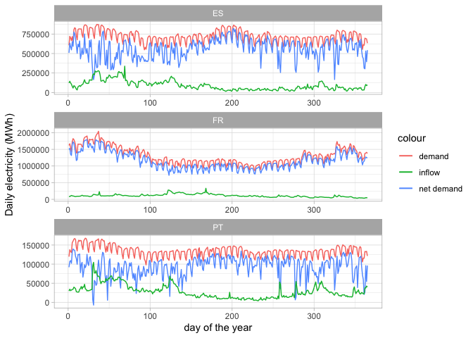
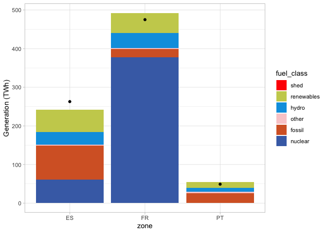
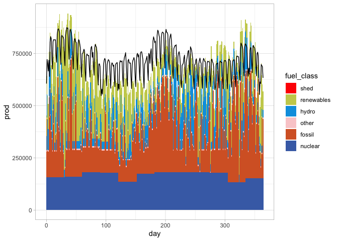
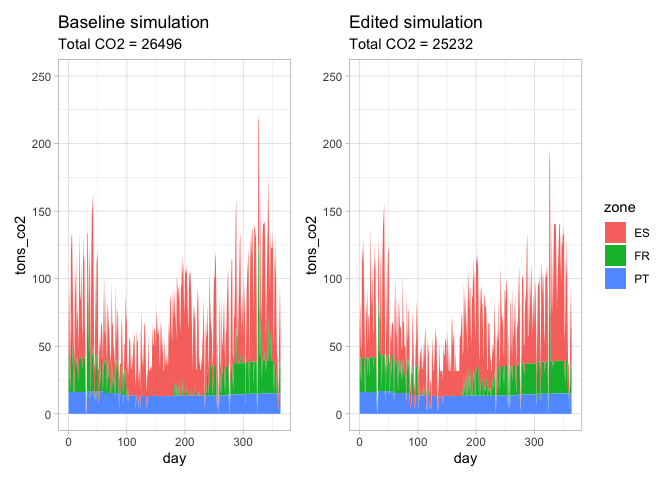
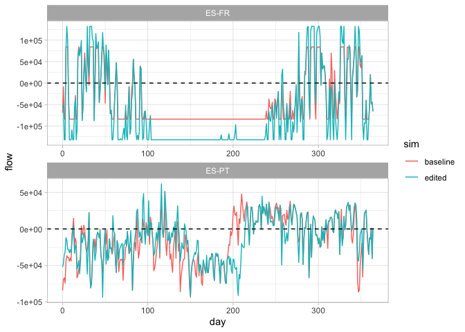

Using YAPOSER
================

## Yaposer tutorial: preparing, editing and analysing a YAPOS simulation

The `yaposer` package can be loader from the Github repository. Other
packages are needed in this example for data wrangling and
visualisation.

``` r
# remotes::install_github("matteodefelice/yaposer", upgrade = "never")
library(yaposer)
library(tidyverse)
```

    ## ── Attaching packages ───────────────────────────── tidyverse 1.3.0 ──

    ## ✓ ggplot2 3.3.1     ✓ purrr   0.3.4
    ## ✓ tibble  3.0.1     ✓ dplyr   0.8.5
    ## ✓ tidyr   1.1.0     ✓ stringr 1.4.0
    ## ✓ readr   1.3.1     ✓ forcats 0.5.0

    ## ── Conflicts ──────────────────────────────── tidyverse_conflicts() ──
    ## x dplyr::filter() masks stats::filter()
    ## x dplyr::lag()    masks stats::lag()

``` r
library(patchwork)
library(glue)
```

    ## 
    ## Attaching package: 'glue'

    ## The following object is masked from 'package:dplyr':
    ## 
    ##     collapse

We start loading the `test` simulation into the workspace. That
simulation is based on the EnVarClim dataset but includes only three
zones: Portugal (PT), Spain (ES) and France (FR). As explained in the
documentation the function `read_input_from_folder` returns 13 data
structures.

``` r
in_data <- read_input_from_folder("db/test/")
names(in_data)
```

    ##  [1] "lin"    "NLINES" "avail"  "UNITS"  "NUNITS" "NSTEPS" "inflow" "ren"   
    ##  [9] "NZONES" "ZONES"  "dem"    "gen"    "stomin"

We can then check if those inputs are well-formed (unnecessary in this
case) and get some useful statistics about the inputs.

``` r
out_summary <- check_input_data(in_data)
```

    ## Warning in check_input_data(in_data): The zones FR have a ratio between net
    ## demand and must-run thermal capacity < 1.5

    ## Warning in check_input_data(in_data): The zones ES, PT, FR have a ratio between
    ## inflow and storage > 0.9

``` r
knitr::kable(out_summary, digits = 2)
```

| zone | demand | net\_demand | cf\_with\_ntc |   cf | cf\_must\_run | inflow | inflow\_capacity\_ratio | inflow\_storage\_ratio |
| :--- | -----: | ----------: | ------------: | ---: | ------------: | -----: | ----------------------: | ---------------------: |
| ES   | 262.90 |      204.64 |          0.32 | 0.35 |          3.63 |  33.06 |                    0.22 |                   1.60 |
| PT   |  49.00 |       34.01 |          0.27 | 0.38 |           Inf |  10.39 |                    0.29 |                   1.74 |
| FR   | 475.16 |      423.94 |          0.52 | 0.54 |          0.93 |  39.96 |                    0.27 |                   9.78 |

Now a bit of data wrangling to tidy the data contained into `in_data`. I
want a data frame usable for `ggplot2` containing demand, renewables
output and inflow. For the first two is quite straightforward but for
the latter we need to aggregate the inflow by zones, summing the values
for all the units in a zone.

``` r
merged_inputs <- bind_rows(
  in_data$dem %>%
    mutate(
      variable = "demand",
      t = seq(1, 365)
    ),
  in_data$ren %>%
    mutate(
      variable = "renewables",
      t = seq(1, 365)
    ),
) %>%
  bind_rows(
    in_data$inflow %>%
      mutate(t = seq(1, 365)) %>%
      pivot_longer(
        -t,
        names_to = "Unit",
        values_to = "inflow"
      ) %>%
      left_join(
        in_data$gen %>%
          select(Unit, bus)
      ) %>%
      rowwise() %>%
      mutate(
        zone = in_data$ZONES[bus + 1]
      ) %>%
      group_by(t, zone) %>%
      summarise(
        inflow = sum(inflow)
      ) %>%
      pivot_wider(names_from = zone, values_from = inflow) %>%
      mutate(variable = "inflow")
  ) %>%
  pivot_longer(
    cols = ES:FR,
    names_to = "zone",
    values_to = "value"
  ) %>%
  pivot_wider(
    names_from = variable,
    values_from = value
  )
```

    ## Joining, by = "Unit"

    ## Warning: Grouping rowwise data frame strips rowwise nature

``` r
knitr::kable(head(merged_inputs))
```

| t | zone |  demand | renewables |    inflow |
| -: | :--- | ------: | ---------: | --------: |
| 1 | ES   |  605616 |   96836.93 | 122096.77 |
| 1 | PT   |  119537 |   27684.17 |  29672.41 |
| 1 | FR   | 1619005 |  122802.36 |  88784.66 |
| 2 | ES   |  721019 |   88217.63 | 144121.33 |
| 2 | PT   |  137647 |   30702.17 |  34261.23 |
| 2 | FR   | 1668098 |  138788.30 |  82379.72 |

A plot can be useful to see the data and spot any inconsistencies.

``` r
g <- ggplot(
  merged_inputs,
  aes(x = t)
) +
  geom_line(aes(y = demand, color = "demand")) +
  geom_line(aes(y = demand - renewables, color = "net demand")) +
  geom_line(aes(y = inflow, color = "inflow")) +
  facet_wrap(~zone, ncol = 1, scales = "free") +
  theme_light() +
  labs(
    x = "day of the year",
    y = "Daily electricity (MWh)"
  )
print(g)
```

<!-- -->

Now we can run the YAPOS simulation. I write the data into `in_data` in
a folder named `my_run_baseline`. Then I launch the YAPOS model. Here a
need a [workaround](https://github.com/conda/conda/issues/7980) to call
an `anaconda` environment from a R system call.

``` r
write_sim_data(in_data, "my_run_baseline")
#
system("source ~/miniconda3/etc/profile.d/conda.sh; conda activate yapos; python main.py my_run_baseline/ baseline")
```

The most important YAPOS feature is the capability to store simulation
outputs and inputs into a single NetCDF file. We can load the results
from a file using the function `get_results`. This function returns a
set of data structures containing post-processed outputs and also a set
of plots (annual generations, CO2 emissions, dispatch plots, etc.)

The shown plot illustrates the annual generation per fuel type, the
black dot indicated the demand.

``` r
baseline_results <- get_results("my_run_baseline/baseline.nc")
```

    ## Joining, by = "unit"

    ## Joining, by = c("unit", "day")
    ## Joining, by = c("unit", "day")

    ## Joining, by = "unit"

    ## Warning in bind_rows_(x, .id): Vectorizing 'glue' elements may not preserve
    ## their attributes
    
    ## Warning in bind_rows_(x, .id): Vectorizing 'glue' elements may not preserve
    ## their attributes

    ## Warning: Unknown levels in `f`: LIG

    ## Joining, by = c("zone", "fuel_class")

    ## Warning: Column `fuel_class` joining character vector and factor, coercing into
    ## character vector

    ## Joining, by = "line"

    ## Curtailment values

    ## # A tibble: 1 x 3
    ##   zone  curtailed `shed load`
    ##   <chr>     <dbl>       <dbl>
    ## 1 FR     1577568.           0

    ## Dual files are present in the same folder of the results

    ## Warning: 1 parsing failure.
    ## row col  expected    actual                                file
    ##   1  -- 3 columns 2 columns 'my_run_baseline/dual_cost_def.txt'

    ## Warning in function_list[[k]](value): NAs introduced by coercion

``` r
print(names(baseline_results))
```

    ## [1] "data"  "plots"

``` r
print(baseline_results$plots$annual_gen)
```

<!-- -->

The dispatch plot is useful to illustrate the energy mix. Imports and
exports are not visualised.

``` r
print(baseline_results$plots$dispatch$ES)
```

<!-- -->

Now we want to create a new simulation changing the capacity of the
interconnector between ES and FR. From 3.5 GW (then 84000 daily MWh) to
5.5 GW (132000 MWh). We can check the inputs and from the pre-processing
data we can also see some small differences.

``` r
print(in_data$lin)
```

    ## # A tibble: 2 x 4
    ##   line_name  from    to   cap
    ##   <chr>     <dbl> <dbl> <dbl>
    ## 1 ES-FR         0     2 84000
    ## 2 ES-PT         0     1 93600

``` r
in_data$lin$cap[1] <- 132000

out_summary <- check_input_data(in_data)
```

    ## Warning in check_input_data(in_data): The zones FR have a ratio between net
    ## demand and must-run thermal capacity < 1.5

    ## Warning in check_input_data(in_data): The zones ES, PT, FR have a ratio between
    ## inflow and storage > 0.9

``` r
knitr::kable(out_summary, digits = 2)
```

| zone | demand | net\_demand | cf\_with\_ntc |   cf | cf\_must\_run | inflow | inflow\_capacity\_ratio | inflow\_storage\_ratio |
| :--- | -----: | ----------: | ------------: | ---: | ------------: | -----: | ----------------------: | ---------------------: |
| ES   | 262.90 |      204.64 |          0.31 | 0.35 |          3.63 |  33.06 |                    0.22 |                   1.60 |
| PT   |  49.00 |       34.01 |          0.27 | 0.38 |           Inf |  10.39 |                    0.29 |                   1.74 |
| FR   | 475.16 |      423.94 |          0.51 | 0.54 |          0.93 |  39.96 |                    0.27 |                   9.78 |

We can then run this new simulation after saving the input files needed
by YAPOS in the folder `my_run_edited`.

``` r
write_sim_data(in_data, "my_run_edited")
system("source ~/miniconda3/etc/profile.d/conda.sh; conda activate yapos; python main.py my_run_edited/ edited")
```

After loading the results, we want to compare the CO2 emissions of the
two simulations: the `baseline` and the `edited` one, the one with the
changed interconnector. We can see that this small change has reduced
the annual CO2 emissions by 5%.

``` r
edited_results <- get_results("my_run_edited/edited.nc")
```

    ## Joining, by = "unit"

    ## Joining, by = c("unit", "day")
    ## Joining, by = c("unit", "day")

    ## Joining, by = "unit"

    ## Warning in bind_rows_(x, .id): Vectorizing 'glue' elements may not preserve
    ## their attributes
    
    ## Warning in bind_rows_(x, .id): Vectorizing 'glue' elements may not preserve
    ## their attributes

    ## Warning: Unknown levels in `f`: LIG

    ## Joining, by = c("zone", "fuel_class")

    ## Warning: Column `fuel_class` joining character vector and factor, coercing into
    ## character vector

    ## Joining, by = "line"

    ## Curtailment values

    ## # A tibble: 1 x 3
    ##   zone  curtailed `shed load`
    ##   <chr>     <dbl>       <dbl>
    ## 1 FR      462537.           0

    ## Dual files are present in the same folder of the results

    ## Warning: 1 parsing failure.
    ## row col  expected    actual                              file
    ##   1  -- 3 columns 2 columns 'my_run_edited/dual_cost_def.txt'

    ## Warning in function_list[[k]](value): NAs introduced by coercion

``` r
baseline_plot <- baseline_results$plots$co2 +
  scale_y_continuous(limits = c(0, 250)) +
  labs(
    title = "Baseline simulation",
    subtitle = glue("Total CO2 = { round( sum(baseline_results$data$final_co2$tons_co2)) }")
  )
edited_plot <- edited_results$plots$co2 +
  scale_y_continuous(limits = c(0, 250)) +
  labs(
    title = "Edited simulation",
    subtitle = glue("Total CO2 = { round( sum(edited_results$data$final_co2$tons_co2)) }")
  )
layout <- baseline_plot + edited_plot + plot_layout(guides = "collect")
print(layout)
```

<!-- -->

As final point we can compare the flows on the two interconnectors among
the two simulations.

``` r
merged_flows <- bind_rows(
  baseline_results$data$flow %>%
    mutate(sim = "baseline"),
  edited_results$data$flow %>%
    mutate(sim = "edited"),
)
g <- ggplot(merged_flows, aes(x = day, y = flow, color = sim)) +
  geom_line() +
  facet_wrap(~line, scales = "free", ncol = 1) +
  geom_hline(yintercept = 0, linetype = "dashed") +
  theme_light()
print(g)
```

<!-- -->
